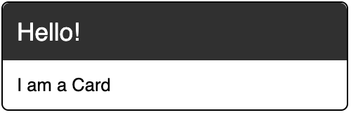
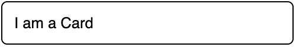
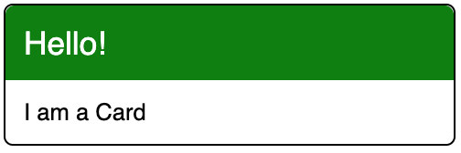
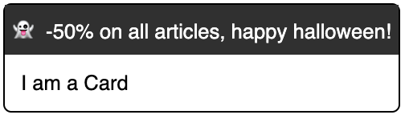
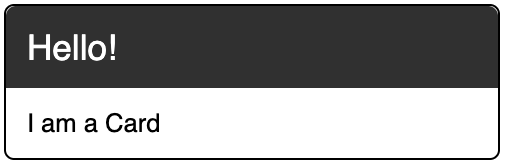
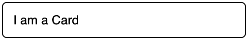
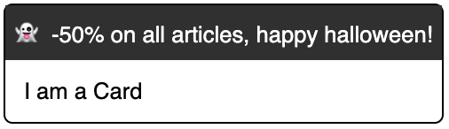

ReactEurope konference se opět konala v Paříži 23. a 24. května, leč letos jsem
navštívil pouze dvou denní workshop, který ji předcházel. Vydal jsem se na něj
již podruhé, po roce a znovu se vše odehrálo ve starém známém konferenčním
centru [Espace Charenton](https://goo.gl/maps/oxu1RK6p4EeqoALq6). Není to extra
místo konání, ale francouzské občerstvení vše vynahradí. Croissantíčky s
kávičkou a obložené bagety byly výborné.

[]()

Workshop vedl Greg Bergé, autor [Shipit](https://github.com/shipitjs/shipit),
[SVGR](https://github.com/smooth-code/svgr) nebo SmoothUI a Oliver Tassiari,
spoluzakladatel neméně známého
[Material-UI](https://github.com/mui-org/material-ui). Ačkoliv název akce nesl
jméno `React.js Workshop on React 17`, hlavním tématem celého workshopu byly
[Hooks](https://reactjs.org/docs/hooks-intro.html), které jsou součástí Reactu
od února 2019, verze 16.8. Popravdě jsem za to byl i rád, že se jedná o
praktická támata, která je možné využít v praxi a na produkci.

Úvodem jsme prolétli historii Reactu a základy. Jaká jsou jeho primitives,
rozdíly mezi typy komponent, life cycle komponenty - fáze:

1. mount - element se vkládá do DOMu
2. update - komponenta se aktualizuje změnou props nebo statu, což je po té
   reflektováno i změnou DOMu
3. unmount - element se odstraní z DOMu

Také se zmínilo, že se již brzy můžeme těšit na Concurent Mode umožňující
schedulování renderování pro lepší performance nebo Suspense pro zjednodušení
fetchovaní.

Dále se pokračovalo už jen s React Hooks. Jsou to funkce, které nám dovolují
zacházet s lifecycle featurami uvnitř functional komponent. Hooky fungují pouze
ve functional komponentách! Jsou základní tři useState, useEffect, useContext a
pak několik dalších, pokročilých. Podrobněji o nich snad přístě.

Ale co bych zde rád více popsal je využití
[Render Props](/content/blog/render-props/index.md) dohromady s React Hooks a
navrhování Styled Components.

### Render Props a Reack Hooks

Tedy, jak bude vidět, Render Props ještě nejsou mrtvý! Pokud bych měl tento
Hook, counter:

```javascript
function useCounter() {
  const [count, setCount] = useState(0)

  useEffect(() => {
    const interval = setInterval(() => setCount(count => count + 1), 1000)
    return () => clearInterval(interval)
  }, [])

  return count
}
```

Kde použijeme hook `useState()` pro nastavení lokálního statu a `useEffect()`
pro spuštění hooku každou sekundu. A použili jej v komponentě

```javascript
function Example() {
  const count = useCounter()

  return (
    <div>
      <OtherStuff />
      <div>{count}</div>
    </div>
  )
}
```

Pak je zavolán `setCount()` s každým tickem intevalu, je vygenerována nová
hodnota statu a `Example` se přerendruje. Kromě něj se přerendruje i
`OtherStuff`, který ale `count` nepoužívá! Navíc, pokud by `useCounter` vyhodilo
chybu, která komponenta bude ta s chybou? `Example`! A proto budeme izolovat
logiku přes Render Props.

```javascript
function Counter({ children }) {
  const count = useCounter()

  return children(count)
}
```

Children je obvykle `node` element, ale zde má podobu funkce - `Render Prop`!

```javascript
function Example() {
    return(
        <div>
            <OtherStuff />
            <Counter>{(count) => <div>{count}</div>}</Couunter>
        </div>
    )
}
```

Co se tedy změnilo, `Example` se nepřerenderuje a ani `OtherStuff`. `Counter`
ale ano a pokaždé zavolá children funkci. Tedy nám Render Props dovolili pěkně
odizolovat renderování 🙂 A pokud bychom dále zabalili `Counter` do
`ErrorBoundaries`, dovolí nám i pěkně odchytnout chybu.

### Styled Components

Pěkný příklad byl pro `Styled Components`. Styly se spojují s daným elementem,
akceptují style funkce a podporují CSS syntaxy. A hlavně pomáhají vyřešit
následující scénář. Máme požadavek pro vytvoření Card komponenty, která může
vypadat následovně.

[]()

```javascript
const CardHeader = styled.div``
const CardBody = styled.div``

const Card = ({title, text}) => (
  <div>
    <CardHeader>{title}</CardHeader>
    <CardBody>{text}</CardBody>
  </div>
)

<Card title="Hello!" text="I am Card" />
```

Pak se ale na scéně objeví product owner s požadavkem, že by chtěl odtranit
titulek, což pro nás není žádný problém a přidáme podmínku k jeho vyrenderování.

[]()

```javascript
const CardHeader = styled.div``
const CardBody = styled.div``

const Card = ({title, text}) => (
  <div>
    {title && <CardHeader>{title}</CardHeader>}
    <CardBody>{text}</CardBody>
  </div>
)

<Card text="I am Card" />
```

Potom se ale ozve UX designér, že by pozadí titulku mělo být zelené, což vypadá
mnohem lépe. Jak je libo, i to můžeme udělat a přidáme novou props definující
barvu pozadí.

[]()

```javascript
const CardHeader = styled.div``
const CardBody = styled.div``

const Card = ({title, titleBackground, text}) => (
  <div>
    {title && (
      <CardHeader style={{ backgroundColor: titleBackground}}>
        {title}
      </CardHeader>
    )}
    <CardBody>{text}</CardBody>
  </div>
)

<Card title="Hello!" titleBackground="green" text="I am Card" />
```

Jen co změny doděláme, objeví se nový marketing manager s přáním, že by chtěl
zobrazit malý ad banner namisto titulku. Mno, i to je možné a opět upravíme naší
komponentu, aby se přizpůsobila i tomuto požadavku.

[]()

```javascript
const CardHeader = styled.div``
const CardBody = styled.div``
const CardAd = styled.div``

const Card = ({title, titleBackground, ad, text}) => (
  <div>
    {add && <CardAd>{ad}</CardAd>}
    {title && (
      <CardHeader style={{ backgroundColor: titleBackground}}>
        {title}
      </CardHeader>
    )}
    <CardBody>{text}</CardBody>
  </div>
)

<Card
  titleBackground="green"
  ad="👻 -50% on all articles, happy halloween!"
  text="I am Card"
/>
```

Ale přidávání dalších a dalších požadavků už je neudržitelné. Tyto požadavky
jsou nekonečné a postupné změny s využitím `Styled Components` mohou být mnohem
jednodušší.

```javascript
export const Card = styled.div``
Card.Body = styled.div``
Card.Header = styled.div``
```

A vše by bylo mnohem jednodušší!

[]()

```javascript
<Card>
  <Card.Header>Hello!</Card.Header>
  <Card.Body>I am a card</Card.Body>
</Card>
```

[]()

```javascript
<Card>
  <Card.Body>I am a card</Card.Body>
</Card>
```

[]()

```javascript
<Card>
  <Card.Header style={{ backgroundColor: 'green' }}>Hello</Card.Header>
  <Card.Body>I am a Card</Card.Body>
</Card>
```

[]()

```javascript
<Card>
  <div
    style={{
      padding: 5,
      backgroundColor: 'black',
      color: 'white',
      fontSize: 14,
    }}
  >
    👻 -50% on all articles, happy halloween!
  </div>
  <Card.Body>I am a Card</Card.Body>
</Card>
```

Doporučuje se začít co nejblíže k samotnému DOM nodu a neabstraktovat příliš
brzo 😉
